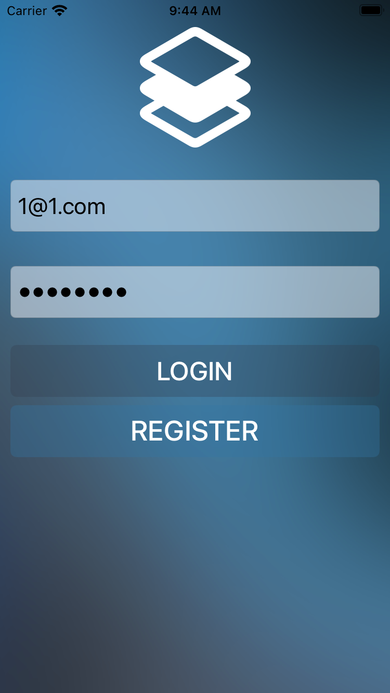
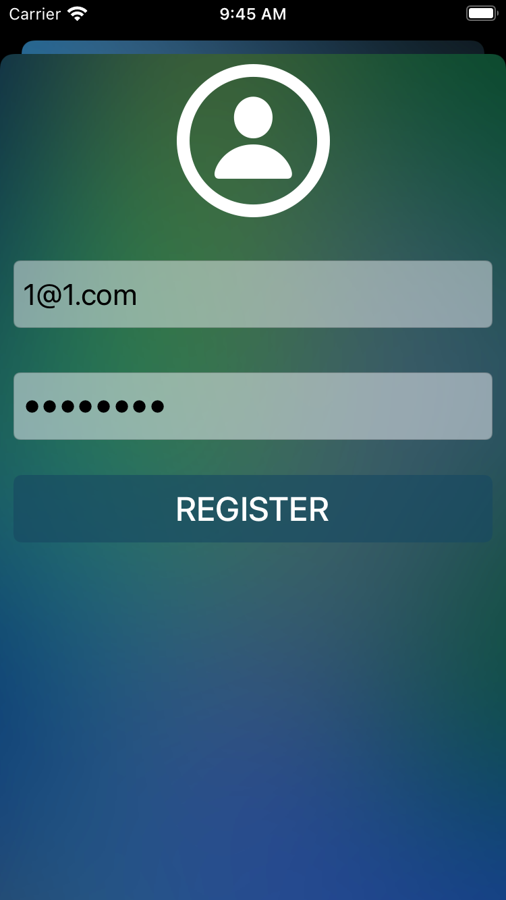
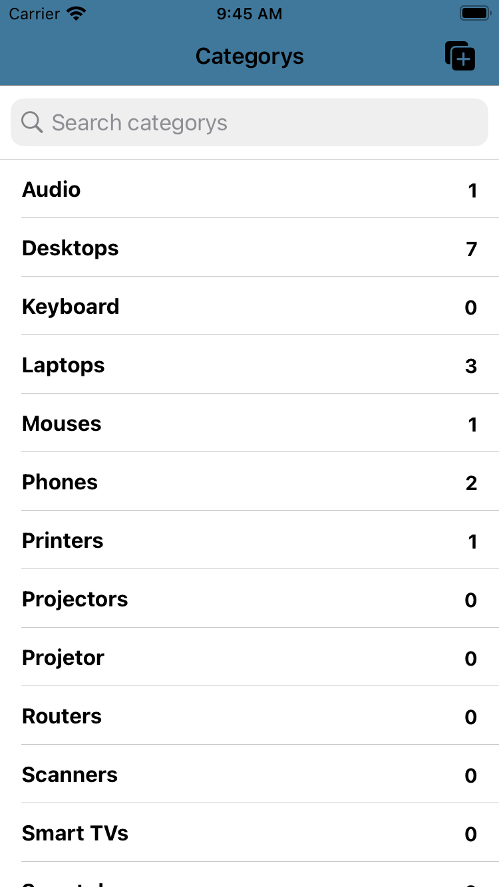
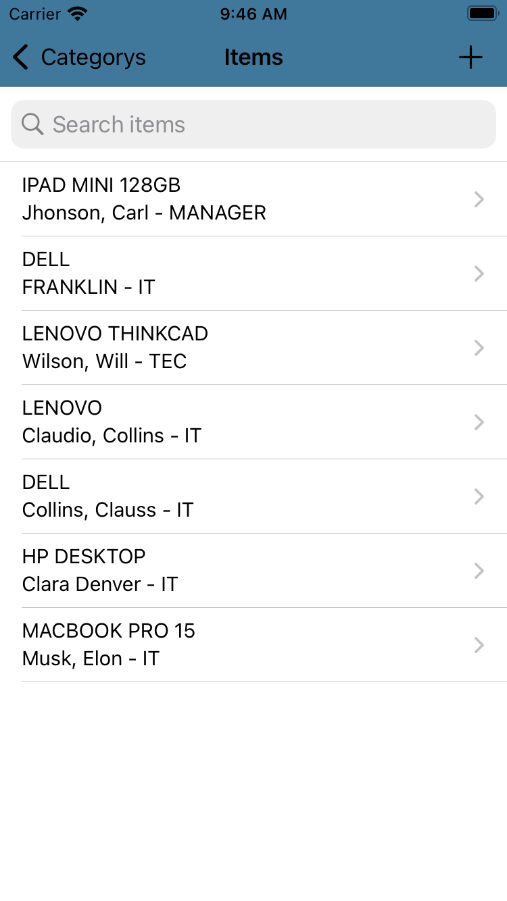
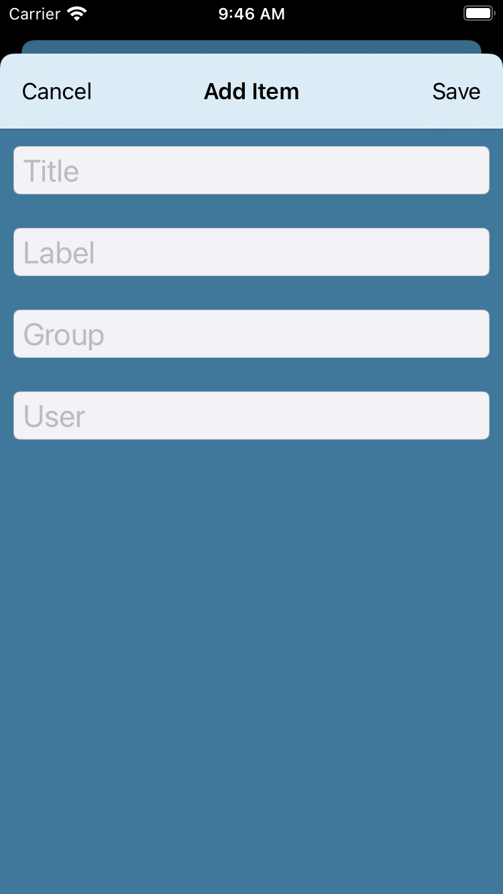
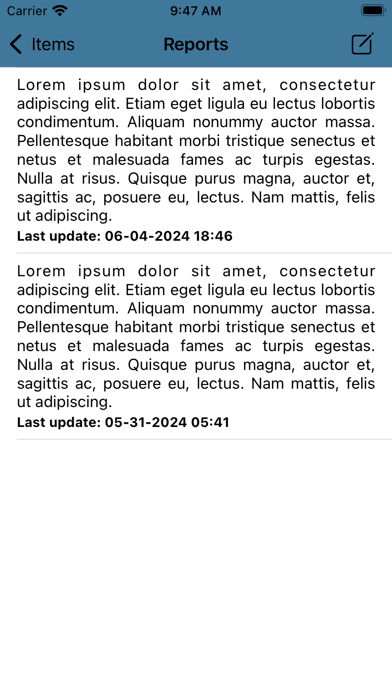
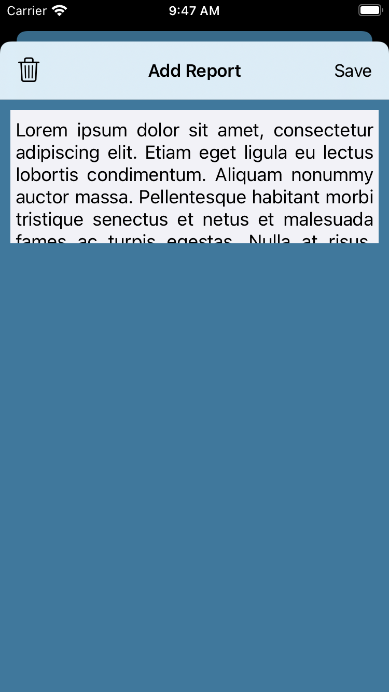

# EquipManage

### Esse é o EquipManage um app que ajuda pessoas que trabalham com manutenção	ou gerenciam equipamentos (sejam eles de qualquer tipo) a terem um controle de cada um deles na palma da mão. O app não só permite fazer um inventário de todos os seus equipamentos classificando por categoria, como também permite emitir relatórios de cada um desses itens para registrar as possíveis manutenções ou ocorrências que este equipamento sofreu. 

### Para desenvolver o EquipManager utilizei Swift e UIKit sendo ele um app nativo para iOS. Para manter as informações sempre disponíveis foi feita a integração com o Firebase, assim mais de um dispositivo pode ter acesso as informações contanto que esteja devidamente com seu usuário autenticado.

## Login Screen / Register Screen:
 

## Home Screen:

## Item Screen / Add Item Screen:

 

## Reports Screen / Add Reports Screen:

 

